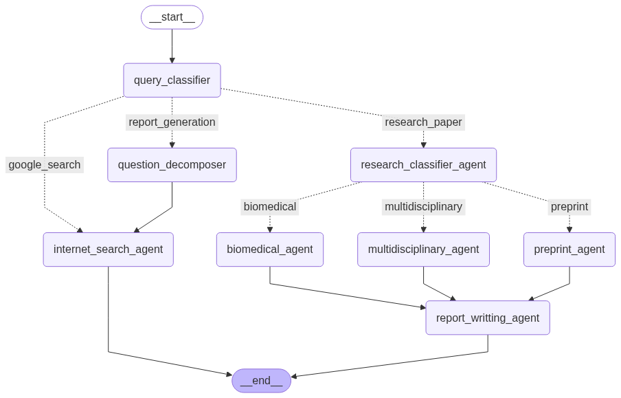

# 🧠✈️ DEEP WEB RESEARCH AGENTIC AI SYSTEM

This is a simple practice project I built to explore how AI agents can search for information from various sources — especially beyond just Google.  
It uses tools like **Tavily** and **DuckDuckGo** to fetch real-time data and academic content, simulating what an "agentic AI" might do when trying to research something on its own.

The project runs completely **locally** using an **Ollama-hosted LLM model** — so we don’t need to rely on cloud APIs like OpenAI or Anthropic to try it out. That makes it easier, private, and great for learning how to build LLM-powered tools with minimal external dependencies.

The main goal here is to experiment with how a system can:  
- Search the web  
- Query scholarly APIs  
- Understand questions better using local AI models  
- And manage responses in a structured way (with caching and multi-source support)

It’s not meant to be production-ready — just a solid learning experiment.

---

## 🧰 Features & Tools Used

### 1. 🧠 Redis Cache  
Used for context memory and quick retrieval of previously searched or fetched data.  
📄 Docs: https://redis.io/docs/

### 2. 🔄 Coreference Resolution  
Improves context understanding by resolving pronouns and references in queries.  
🔍 Model: `biu-nlp/f-coref` (HuggingFace)

### 3. 🧑‍💻 Personal Assistants  
Implements autonomous agents that manage search, reasoning, and response pipelines.  
🤖 Built using AI agent frameworks or custom orchestration

### 4. 📚 Scholarly (Google Scholar Scraper)  
Extracts academic papers directly from Google Scholar using a Python library.  
📦 PyPI: https://pypi.org/project/scholarly/

### 5. 🧾 arXiv API  
Fetches preprints and research papers from arXiv.org.  
🔗 Endpoint: http://export.arxiv.org/api/{method_name}?{parameters}  
📖 Docs: https://info.arxiv.org/help/api/user-manual.html#Quickstart

### 6. 📖 Springer Nature Open Access API  
Retrieves open access content from Springer journals.  
🌐 Access: https://datasolutions.springernature.com/account/api-management/  
📌 Sample Usage:  
https://api.springernature.com/openaccess/jats?q=deep+learning&api_key=YOUR_API_KEY

### 7. 🧬 PubMed  
Provides access to biomedical research papers.  
🔗 URL: https://account.ncbi.nlm.nih.gov/settings/

### 8. 🧪 ScienceDirect (Elsevier)  
Another gateway to scientific papers and journal content via Elsevier.  
🌍 Access: https://dev.elsevier.com/apikey/manage  
🏷️ Label: ScienceDirectQueryTool

### 9. 🧠 Semantic Scholar API  
Gives access to semantic metadata and citations for academic papers.  
🛠️ Endpoint: https://api.semanticscholar.org/graph/v1/paper/batch  
📘 Docs: https://api.semanticscholar.org/api-docs/#tag/Paper-Data/operation/get_graph_get_paper_autocomplete

---

## 📸 Architecture of this System

<div align="center">
  
</div>

---
## 📂 Sample Output Directory

- [Deep_Web_Research_Response_2025-07-21_01-01-10.md](backend/save_to_documents/Deep_Web_Research_Response_2025-07-21_01-01-10.md)
- [Deep_Web_Research_Response_2025-07-21_01-21-09.md](backend/save_to_documents/Deep_Web_Research_Response_2025-07-21_01-21-09.md)
- [Deep_Web_Research_Response_2025-07-21_02-55-59.md](backend/save_to_documents/Deep_Web_Research_Response_2025-07-21_02-55-59.md)
- [Deep_Web_Research_Response_2025-07-21_03-08-47.md](backend/save_to_documents/Deep_Web_Research_Response_2025-07-21_03-08-47.md)
- [Deep_Web_Research_Response_2025-07-21_14-19-49.md](backend/save_to_documents/Deep_Web_Research_Response_2025-07-21_14-19-49.md)


## 🚀 Running the Agentic Research Server

```bash
# Start Ollama (model hosting for LLMs)
ollama serve

# Start the FastAPI server
uvicorn app:app --host 0.0.0.0 --port 8000

# (Optional) Use hot reload for development
uvicorn app:app --reload --host 0.0.0.0 --port 8000
---